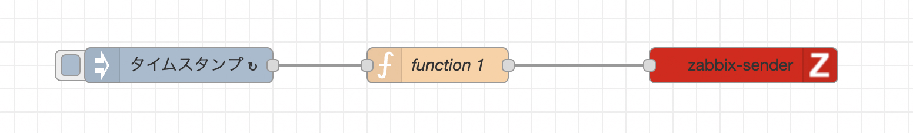
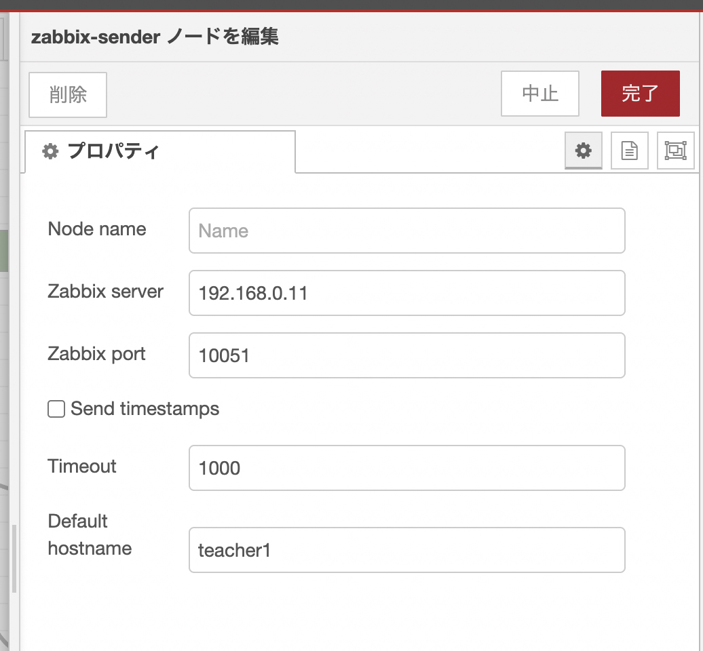
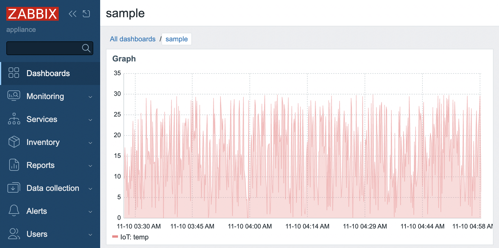

# IoTシステムの構築とその応用(2)


# NASを用いたローカルIoTシステムの構築

### NASの概要

NAS(Network Attached Storage)は，ネットワークに接続されたストレージ装置のことです．
NASは，ネットワーク上の複数のデバイスからアクセス可能であり，ファイル共有やバックアップ，データの集中管理などに利用されます．

### 利用するNAS

本演習では，QNAP社のNASを利用しています．
QNAP社のNASは，ただのファイルサーバーではなく，様々なアプリケーションをインストールして利用することができます．

今回は，以下のアプリケーションを利用します．
- Virtualization Station

### Virtualization Station

Virtualization Stationは，QNAPのNAS上で仮想マシンを作成，管理するためのアプリケーションです．

#### QVSのＶＭ確認（表示のみ）

次のアドレスで，QVSの管理画面にアクセスします．
- URL: http://172.16.86.114:8080/qvs


```
loing: user
password: uitec25
```


## モニタリングIoTシステムの構築

### 概要

本演習では，Zabbixを利用して，モニタリングIoTシステムを構築します．
Zabbixは，オープンソースの監視プラットフォームであり，様々なIoTデバイスを統合して監視することができます．
ZabbixをQNAPのNAS上に構築し，IoTデバイスと連携させることで，モニタリングIoTシステムを構築します．

### ログイン

Zabbixのログイン画面に管理者としてアクセスします．
- URL: http://\[ZabbixのIPアドレス\] 
- 今回の演習では次のＩＰアドレスとなります．
  - Zabbix: `172.16.86.115`

#### ユーザー名とパスワード(初期値)
- username: Admin
- password: zabbix


### ホストの追加

ZabbixにIoTデバイスをホストとして追加します．
1. メニューから「Monitoring」->「Hosts」を選択します．
2. 「Create Host」ボタンをクリックします．
3. ホスト名，グループの情報を入力します．
4. 「追加」ボタンをクリックしてホストを作成します

### アイテムの追加
ホストに監視したいアイテムを追加します．
1. ホストの詳細画面で「Items」タブを選択します．
2. 「Create Item」ボタンをクリックします．
3. アイテム名，タイプ，キー，更新間隔などの情報を入力します．
4. 「追加」ボタンをクリックしてアイテムを作成します


### ダッシュボードの作成
監視結果を可視化するために，ダッシュボードを作成します．
1. メニューから「ダッシュボード」->「新しいダッシュボード」を選択します．
2. ウィジェットを追加して，監視結果を表示します．
3. ダッシュボードのレイアウトやデザインをカスタマイズします．
4. 「保存」ボタンをクリックしてダッシュボードを保存します

## Node-REDとの連携

ZabbixとNode-REDを連携させることで，IoTデバイスの監視データをリアルタイムで処理・分析できます．
### Node-REDにZabbixノードをインストール

Node-REDのパッケージマネージャを利用して，Zabbixへテレメトリ送信を行うためのパッケージをインストールします．

`node-red-contrib-zabbix-sender` を検索し，インストールします．

### zabbix-senderノード, injectノード，functionノードの追加

zabbix-senderノード，injectノード，functionノードを追加し，以下のように接続します．
<center>
    
</center>

#### functionノードの内容は以下の通りです．

```javascript
function getRandomArbitrary(min, max) {
  return Math.random() * (max - min) + min;
}

let temp = getRandomArbitrary(0, 30); 

msg.payload = ["IoT", "temp", temp];
return msg;
```

コード解説

- getRandomArbitrary(min, max): minからmaxの範囲でランダムな数値を生成する関数です．
- let temp = getRandomArbitrary(0, 30);: 0から30の範囲でランダムな温度値を生成し，temp変数に格納します．
- msg.payload = ["IoT", "temp", temp];: Zabbixに送信するデータを設定します．配列の形式で，ホスト名，アイテムキー，値を指定しています．
- return msg;: 処理結果をmsgオブジェクトとして返します．


#### zabbix-senderノードの設定


- Zabbix Server: ZabbixサーバーのIPアドレスを入力します．
- Zabbix Port: 10051
- Default Hostname: Zabbixに登録したホスト名を入力します．

<center>
    
</center>


#### injectノードの設定
- Payload: timestamp
- Repeat: interval (例: 5秒)

### フローのデプロイと動作確認

フローをデプロイし，injectノードを手動でトリガーします．
Zabbixのホストのアイテムで，監視データが更新されていることを確認します．


<center>
    
</center>


### リファレンス 
- QNAP Virtualization Station
  - https://www.qnap.com/solution/virtualization_station/ja/
- Zabbix Documentation
  - https://www.zabbix.com/documentation/current/ja/manual


---
